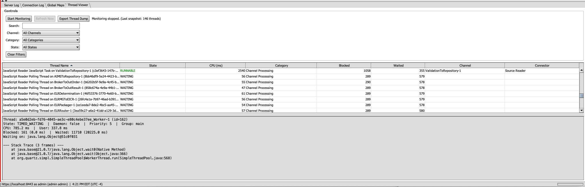

# OIE Thread Viewer Plugin

A dashboard plugin for Open Integration Engine (OIE) that provides real-time JVM thread monitoring
with channel-aware filtering, deadlock detection, and jstack-compatible thread dump export.



## Features

- Live thread table with state, CPU time, blocked/waited counts, and full stack traces
- Channel-aware thread correlation using OIE's thread naming conventions
- Category classification (Channel Processing, Database Pool, HTTP/Servlet, System/JVM, etc.)
- Deadlock detection via `ThreadMXBean.findDeadlockedThreads()`
- Filterable by search text, channel, category, and thread state
- jstack-compatible thread dump export (compatible with fastthread.io)
- Data retained after stop for offline browsing and export
- Zero overhead when not monitoring — contention tracking enabled only while active
- Admin-only access via OIE's `ExtensionPermission` system

## Requirements

- OIE 4.5.2+
- Java 17+

## Building

Requires OIE libraries in your Maven repository.

```bash
mvn clean package
```

The plugin ZIP will be in `package/target/thread-viewer-1.0.0.zip`.

## Installation

Install using the Extensions manager in the OIE Administrator, or manually extract
to the `extensions` directory. A restart is required after installation.

## Usage

1. Open the OIE Administrator and navigate to the **Threads** dashboard tab
2. Click **Start Monitoring** to begin capturing thread snapshots
3. Use the filters (search, channel, category, state) to narrow the view
4. Click any thread row to view its full stack trace
5. Click **Export Thread Dump** to save a jstack-compatible dump file
6. Click **Stop Monitoring** when done — thread data is retained for browsing

## Thread Dump Export

The exported file follows the standard `jstack` output format and is compatible with
analysis tools such as [fastthread.io](https://fastthread.io). The export includes:

- Thread header with name, ID, daemon status, priority, and CPU time
- `java.lang.Thread.State` with qualifiers (`on object monitor`, `parking`)
- Full stack traces with interleaved lock/monitor info
- Locked ownable synchronizers
- Deadlock section

## License

MIT License
